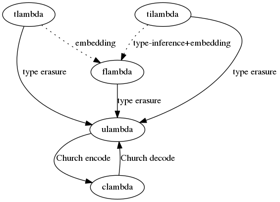

# Lambdasylum
[](https://travis-ci.org/rootmos/lambdasylum)

The lambda asylum is a place to try out different kinds of lambda calculi.
Currently the following calculi are implemented:
* a core calculus with thunks (in [`clambda`](./clambda.ml))
* an [untyped lambda calculus](https://en.wikipedia.org/wiki/Lambda_calculus) (in [`ulambda`](./ulambda.ml))
  with [Church encoded](https://en.wikipedia.org/wiki/Church_encoding) natural numbers and booleans
* a [simply type lambda calculus](https://en.wikipedia.org/wiki/Simply_typed_lambda_calculus) (in [`tlambda`](./tlambda.ml))
* a [System F](https://en.wikipedia.org/wiki/System_F)-style calculus (in [`flambda`](./flambda.ml))
* a [Hindley-Milner](https://en.wikipedia.org/wiki/Hindley%E2%80%93Milner_type_system)-style type-inferred calculus (in [`tilambda`](./tilambda.ml))



## Usage
Simplest way to try it out is by using Docker:
```
docker run -it rootmos/lambdasylum
```

## Examples
These example reductions are automagically generated by running the tests.

### Examples for clambda
`λx.x` ⟶ `λy.y (α-equiv)`

`(λx.x) (λy.y y)` ⟶ `λz.z z (α-equiv)`

`(λx.λ_.x)` ⟶ `λa.λb.a (α-equiv)`

`(λ_.λy.y)` ⟶ `λa.λb.b (α-equiv)`

`(λx.λy.x) (λa.a) (λb.b b)` ⟶ `λa.a (α-equiv)`

`(λx.λy.y) (λa.a) (λb.b b)` ⟶ `λb.b b (α-equiv)`

`((λx.{x}) (λa.a))!` ⟶ `λa.a (α-equiv)`

`((λx.(λx.{x}) (λa.a)) (λb.b b))!` ⟶ `λa.a (α-equiv)`

`((λx.(λy.{x}) (λa.a)) (λb.b b))!` ⟶ `λb.b b (α-equiv)`

`λx.(λy.y) x` ⟶ `λa.(λb.b) a (α-equiv)` ※ reduction stops at λ, no full β-reduction (which would have yielded `λx.x`)

`(λx.λ_.x) ((λy.y) (λz.z z))` ⟶ `λ_.λz.z z (α-equiv)` ※ reduction eagerly evaluates arguments (when starting with the β-reduction: `λ_.(λy.y) (λz.z z)`)

`⊥` ⟶ `reached bottom`

`{⊥}` ⟶ `{..}`

`{{⊥}}` ⟶ `{..}`

`{{⊥}}!` ⟶ `{..}`

`{{⊥}}!!` ⟶ `reached bottom`

`{λx.x}!` ⟶ `λx.x (α-equiv)`

`(λx.x)!` ⟶ `λx.x (α-equiv)` ※ forcing a non-thunk is accepted (in the untyped setting)

`{λx.x} (λy.y y)` ⟶ `λy.y y (α-equiv)` ※ thunks showing up function position are forced (in the untyped setting)

`{(λx.x) (λx.λy.x)}!` ⟶ `λx.λ_.x (α-equiv)`

`((λx.x) (λx.λy.x))!` ⟶ `λx.λ_.x (α-equiv)`


### Examples for ulambda
`0` ⟶ `0`

`1` ⟶ `1`

`(λx.x) 1` ⟶ `1`

`(\lambda x.x) 1` ⟶ `1`

`#t` ⟶ `true`

`#f` ⟶ `false`

`#t` ⟶ `λx.λy.x (α-equiv)`

`#t` ⟶ `λx.λy.y (α-equiv)`

`1+2` ⟶ `3`

`2+1` ⟶ `3`

`0+1` ⟶ `1`

`1+0` ⟶ `1`

`7-2` ⟶ `5`

`0-0` ⟶ `0`

`1-0` ⟶ `1`

`0-1` ⟶ `0` ※ subtraction is floored at 0

`2-2` ⟶ `0`

`0*4` ⟶ `0`

`3*4` ⟶ `12`

`0` ⟶ `λf.λx.x (α-equiv)`

`1` ⟶ `λf.λx.f x (α-equiv)`

`2` ⟶ `λf.λx.f (f x) (α-equiv)`

`succ 0` ⟶ `1`

`succ 1` ⟶ `2`

`succ 7` ⟶ `8`

`pred 0` ⟶ `0`

`pred 1` ⟶ `0`

`pred 2` ⟶ `1`

`pred 7` ⟶ `6`

`if #t 1 2` ⟶ `1`

`if #f 1 2` ⟶ `2`

`and #t #t` ⟶ `true`

`and #f #t` ⟶ `false`

`and #t #f` ⟶ `false`

`and #f #f` ⟶ `false`

`if (and #t #t) 1 2` ⟶ `1`

`if (and #f #t) 1 2` ⟶ `2`

`if (and #t #f) 1 2` ⟶ `2`

`if (and #f #f) 1 2` ⟶ `2`

`if (or #t #t) 1 2` ⟶ `1`

`if (or #f #t) 1 2` ⟶ `1`

`if (or #t #f) 1 2` ⟶ `1`

`if (or #f #f) 1 2` ⟶ `2`

`if (zero? 0) 1 2` ⟶ `1`

`if (zero? 1) 1 2` ⟶ `2`

`if (zero? 7) 1 2` ⟶ `2`

`if (leq? 3 4) 1 2` ⟶ `1`

`if (leq? 3 3) 1 2` ⟶ `1`

`if (leq? 4 3) 1 2` ⟶ `2`

`if (eq? 3 4) 1 2` ⟶ `2`

`if (eq? 3 3) 1 2` ⟶ `1`

`if (eq? 4 3) 1 2` ⟶ `2`

`⊥` ⟶ `reached bottom`

`\bot` ⟶ `reached bottom`

`{⊥}` ⟶ `{..}`

`{{⊥}}` ⟶ `{..}`

`{0}!` ⟶ `0`

`{{0}}!` ⟶ `{..}`

`{{0}}!!` ⟶ `0`

`0!` ⟶ `0`

`{λx.x} 2` ⟶ `2`

`if #t 0 {⊥}` ⟶ `0`

`if #f {⊥} 1` ⟶ `1`

`if #f {0} ⊥` ⟶ `reached bottom`

`(if #t {0} {⊥})!` ⟶ `0`

`(if #f {0} {⊥})!` ⟶ `reached bottom`

`(if #t 1 {⊥})!` ⟶ `1`

`((if #t 1 {2})!)+1` ⟶ `2`

`((if #f 1 {2})!)+1` ⟶ `3`

`(fix (λk.λn.(if (eq? n 1) 1 {(k (n-1))*n})!)) 5` ⟶ `120` ※ factorial function

`(fix (λk.λn.(if (leq? n 1) 1 {(k (n-1))+(k (n-2))})!)) 7` ⟶ `21` ※ naive Fibonacci sequence

`nil? nil` ⟶ `true`

`nil? (cons 0 nil)` ⟶ `false`

`head nil` ⟶ `reached bottom`

`head (cons 0 nil)` ⟶ `0`

`nil? (tail (cons 0 nil))` ⟶ `true`

`head (tail (cons 0 (cons 1 nil)))` ⟶ `1`

`nil` ⟶ `λx.λy.y (α-equiv)`

`nil? (tail nil)` ⟶ `true` ※ `tail nil` reduces to `nil`


### Examples for tlambda
`(λx:int.x) 0` ⟶ `0`

`(λf:(int->int).f 1) (λx:int.x)` ⟶ `1`

`(λx:int.λy:bool.x) 0 #t` ⟶ `0`

`(λx:bool.λy:int.y) #t 0` ⟶ `0`

`(λx:int.λy:int.x) 0 1` ⟶ `0`

`(λx:int.λy:int.y) 0 1` ⟶ `1`

`(λx:bool.x) 0` ⟶ `type error`

`0!` ⟶ `type error` ※ can not force a non-thunk in the typed setting

`{λx:int.x} 0` ⟶ `type error` ※ contrary to the untyped calculs, thunks in function position are not forced

`{0}!` ⟶ `0`

`and #t #f` ⟶ `false`

`or #t #f` ⟶ `true`

`1+2` ⟶ `3`

`2-1` ⟶ `1`

`2*3` ⟶ `6`

`zero? 0` ⟶ `true`

`zero? 1` ⟶ `false`

`eq? 1 7` ⟶ `false`

`eq? 7 7` ⟶ `true`

`leq? 1 7` ⟶ `true`

`leq? 7 7` ⟶ `true`

`leq? 8 7` ⟶ `false`

`succ 2` ⟶ `3`

`pred 2` ⟶ `1`


### Examples for flambda
`(λx:int.x) 0` ⟶ `0`

`(ΛT.λx:T.x) [int] 0` ⟶ `0`

`(ΛT.λx:T.x) [bool] 0` ⟶ `type error`

`(λf:∀T.T->T.f [int] 0) (ΛA.λa:A.a)` ⟶ `0`

`(λf:∀T.∀T.T->T.f [bool] [int] 0) (ΛA.ΛA.λa:A.a)` ⟶ `0`

`(λx:int.x) ⊥` ⟶ `reached bottom` ※ ⊥ is a subtype of any type

`⊥ 7` ⟶ `reached bottom` ※ ⊥ can be typed as any function type as well

`if [int] #t 0 1` ⟶ `0` ※ `if: ∀T.bool->T->T->T`

`if [int] #f 0 1` ⟶ `1`

`(if [{int}] #t {0} {⊥})!` ⟶ `0`

`(if [{int}] #f {⊥} {1})!` ⟶ `1`

`nil? [int] (nil [int])` ⟶ `true` ※ `nil: ∀T.∀Z.(T->Z->Z)->Z->Z`

`nil? [bool] (nil [bool])` ⟶ `true` ※ `nil?: ∀T.(∀Z.(T->Z->Z)->Z->Z)->bool`

`nil? [bool] (nil [int])` ⟶ `type error`

`nil? [int] (cons [int] 0 (nil [int]))` ⟶ `false` ※ `cons: ∀T.T->(∀Z.(T->Z->Z)->Z->Z)->(∀Z.(T->Z->Z)->Z->Z)`

`nil? [bool] (cons [bool] #t (nil [bool]))` ⟶ `false`

`(cons [bool] #t (nil [int]))` ⟶ `type error`

`(cons [int] 0 (nil [bool]))` ⟶ `type error`

`head [int] (nil [int])` ⟶ `reached bottom` ※ `head: ∀T.(∀Z.(T->Z->Z)->Z->Z)->T`

`head [int] (cons [int] 0 (nil [int]))` ⟶ `0`

`head [bool] (cons [bool] #f (nil [bool]))` ⟶ `false`

`nil? [int] (tail [int] (cons [int] 0 (nil [int])))` ⟶ `true` ※ `tail: ∀T.(∀Z.(T->Z->Z)->Z->Z)->(∀Z.(T->Z->Z)->Z->Z)`

`head [int] (tail [int] (cons [int] 0 (cons [int] 1 (nil [int]))))` ⟶ `1`


### Examples for tilambda
`(λx:int.x+1) 0` ⟶ `1`

`(λx.x+1) 0` ⟶ `1`

`(λx.x+1) #t` ⟶ `type error`

`0:int` ⟶ `0`

`⊥:int` ⟶ `reached bottom` ※ ⊥ can be unified to any type

`0:bool` ⟶ `type error`

`(⊥:int->bool) 7` ⟶ `reached bottom`

`0!` ⟶ `type error` ※ can not force a non-thunk in the typed setting

`{λx:int.x} 0` ⟶ `type error` ※ contrary to the untyped calculs, thunks in function position are not forced

`{0}!` ⟶ `0`

`if #t 0 1` ⟶ `0` ※ `if: ∀T.bool->T->T->T` (poly-type or rank-1 (prenex) polymorphism)

`(if #t {0} {⊥})!` ⟶ `0`

`nil? nil` ⟶ `true`

`nil? (cons 0 nil)` ⟶ `false`

`head nil` ⟶ `reached bottom`

`head (cons 0 nil)` ⟶ `0`

`nil? (tail (cons 0 nil))` ⟶ `true`

`head (tail (cons 0 (cons 1 nil)))` ⟶ `1`

`nil` ⟶ `λx.λy.y (α-equiv)`

`nil? (tail nil)` ⟶ `true`

`cons #t (cons 0 nil)` ⟶ `type error`

`cons 0 (cons #f nil)` ⟶ `type error`

`λf.(λ_.f 0) (f #t)` ⟶ `type error`

`let x = 1 in x+1` ⟶ `2`

`let f = λy.y+1 in f 1` ⟶ `2`

`let f = λx.x in (λ_.f 0) (f #t)` ⟶ `0` ※ let-polymorphism

`let f = λx.x in let g = f in (λ_.g 0) (g #t)` ⟶ `0`

`let f = λx.x in (λg.(λ_.g 0) (g #t)) f` ⟶ `type error` ※ rank-2 polymorphism not supported

`let f = λx.λtl.cons x tl in head (f 0 nil)` ⟶ `0`

`let f = λx.λtl.cons x tl in head (f 0 1)` ⟶ `type error`

`λx.let f = λy.y+x in and x x` ⟶ `type error`


